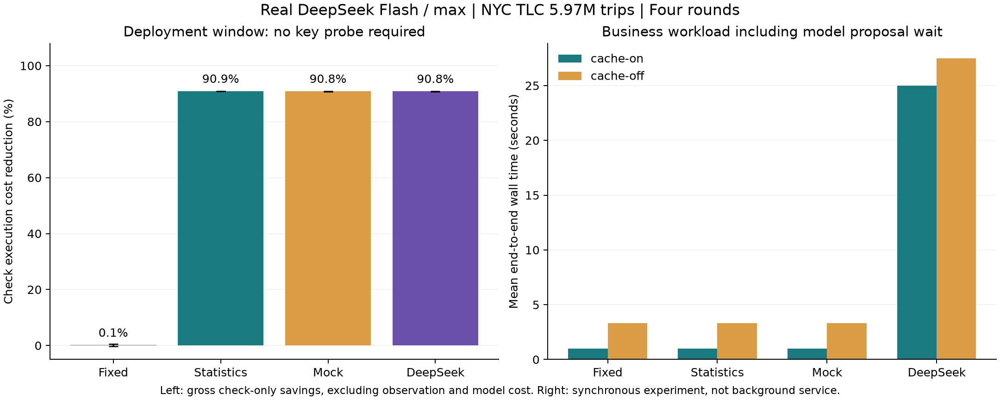

# DeepSeek 真实数据对照实验（2026-09-29）

模型：DeepSeek 官方 `deepseek-flash`（V4.1 Flash），thinking enabled，reasoning_effort=max。固定规则 B、内置统计反馈 D、Mock M、真实模型 L 使用同一 release 可执行文件。

**结论：本次真实模型没有表现出优于统计反馈或 Mock 的增量收益。** 无需补查的失败候选上，模型能够通过独立验证并显著减少检查执行耗时，但便宜的统计策略也得到相同收益；正常业务没有实际换序，同步模型提案增加了全程等待。该结论只覆盖本次数据、负载及三检查排列的策略空间。

## 设计与边界

- 数据：NYC TLC 2024 年 1、2 月全部 5,972,150 条行程，265 个区域，数据库约 1.027 GiB；来源和 SHA256 在原始 manifest 中。没有复制业务行扩容。
- 正常业务：24 个脚本 agent，320 个参数化任务（10 种 SQL 结构），4 轮轮换模式顺序，结果缓存开/关各一套。不是 24 个大模型 agent，也不是 320 种独立 SQL 结构。
- 正常业务 M/L 在 D 的内置反馈之上增加管理提案，在一月结束后提案、二月结束后校验；没有应用后的第三阶段，因此只能评估提案开销和验证门槛，不能据此宣称已部署策略带来端到端提升。
- 失败检查专项：每轮两个受控的补查状态，每状态 48 个日期候选；前 8 个训练、接着 8 个独立验证，最后 32 个观察部署效果。D 使用已有的 3 样本/8 新候选规则，可能早于 M/L 启用，因此同时报告共同的最后 32 个候选。
- 每个候选以交替顺序真实执行当前策略和固定策略，比较判定及耗时；随后执行全部检查采集证据，额外成本单列。模型仅获得聚合性能统计，不能生成 SQL 或关闭检查。
- 同一数据库顺序运行，固定每轮工作负载种子，不清空 OS/PG 缓存。四轮 t 区间是描述性区间，不代表生产分布或严格随机独立样本；没有因结果不好重跑。

## 正常业务结果

| 缓存 | 组 | 正确任务 / 总任务 | 平均 DB 累计时间 s | 平均全程墙钟 s | 策略应用数 |
|---|---|---:|---:|---:|---:|
| cache-on | B | 30720 / 30720 | 12.186 | 0.999 | 0 |
| cache-on | D | 30720 / 30720 | 11.210 | 0.984 | 0 |
| cache-on | M | 30720 / 30720 | 11.489 | 1.003 | 0 |
| cache-on | L | 30720 / 30720 | 11.730 | 24.982 | 0 |
| cache-off | B | 30720 / 30720 | 50.063 | 3.307 | 0 |
| cache-off | D | 30720 / 30720 | 49.980 | 3.306 | 0 |
| cache-off | M | 30720 / 30720 | 49.866 | 3.298 | 0 |
| cache-off | L | 30720 / 30720 | 49.631 | 27.485 | 0 |

正常业务实际换序轨迹共 0 次。DB 时间是并发 SQL 耗时之和，不能当作用户等待时间。全程墙钟包括同步模型提案；后台异步部署会有不同的延迟表现。

| 缓存 | L 对照组 | DB 成本减少（四轮均值及描述性 95% 区间） | 全程墙钟减少 |
|---|---|---:|---:|
| cache-on | B | 2.85% [-23.30, 28.99] | -2380.98% [-3734.48, -1027.48] |
| cache-on | D | -4.55% [-10.59, 1.49] | -2448.44% [-3938.01, -958.87] |
| cache-on | M | -2.09% [-3.55, -0.63] | -2415.75% [-3946.96, -884.53] |
| cache-off | B | 0.83% [-3.58, 5.24] | -733.42% [-1269.32, -197.53] |
| cache-off | D | 0.66% [-2.33, 3.65] | -738.14% [-1289.82, -186.45] |
| cache-off | M | 0.39% [-5.96, 6.74] | -730.49% [-1245.33, -215.66] |

正值表示节省，负值表示更慢。若策略没有实际改变，DB 时间差异不能归因为模型优化。

## 失败检查专项

| 需补查键 | 组 | 全 48 候选的检查成本节省 | 最后 32 候选的检查成本节省 | 实际采用次数 / 全部候选 |
|---|---|---:|---:|---:|
| 是 | B | -0.75% [-2.82, 1.31] | 0.19% [-0.45, 0.82] | 0 / 192 |
| 是 | D | -0.59% [-1.23, 0.04] | -0.42% [-1.33, 0.49] | 0 / 192 |
| 是 | M | -0.19% [-1.20, 0.81] | -0.15% [-1.32, 1.02] | 0 / 192 |
| 是 | L | -0.34% [-1.05, 0.37] | 0.11% [-0.61, 0.82] | 0 / 192 |
| 否 | B | -0.22% [-0.81, 0.38] | 0.13% [-0.20, 0.46] | 0 / 192 |
| 否 | D | 65.75% [65.53, 65.98] | 90.88% [90.82, 90.93] | 144 / 192 |
| 否 | M | 57.63% [57.49, 57.77] | 90.85% [90.74, 90.96] | 128 / 192 |
| 否 | L | 57.45% [57.04, 57.87] | 90.82% [90.69, 90.95] | 128 / 192 |

上述节省仅为检查执行的毛收益，不包含完整采样、模型费用或网络等待。固定组 B 两次执行相同顺序，非零差值反映测量噪声。

| 需补查键 | L 候选/固定检查累计 s | L 完整观察成本 s | 判定一致 / 候选数 |
|---|---:|---:|---:|
| 是 | 4.353 / 4.339 | 9.384 | 192 / 192 |
| 否 | 1.837 / 4.318 | 9.340 | 192 / 192 |

无需补查场景：L 全部四轮毛节省 2.481 秒，但完整观察额外花费 9.340 秒，模型提案另等待 43.742 秒。该专项为单工作线程，因此这些时间可以比较；即便不计模型费用，当前实验规模也没有抵消证据采集成本。配对固定策略的对照执行另属实验测量开销，未算成生产所需成本。

这些候选是人为选择的真实数据错误关联，不是自然生产流量；判定一致只证明这组候选的一致性，不能证明任意 SQL 的语义正确性。

## 模型用量与可解释性

- 成功 API 响应：16；输入 4,870 tokens，输出 55,057 tokens，其中推理 51,640；成功响应累计等待 262.298 秒。推理 tokens 是输出的子集，不重复相加。
- 进程/提案错误记录：0。费用未按未经核实的单价换算；超时和重试可能产生未返回的用量，以上只统计收到的 usage。
- 模型的理由、输入统计、提案顺序、验证结果和应用/拒绝轨迹均保存在本地 JSON；未保存或公开模型内部思维链。
- 模型能看到三种检查的总体失败率和成本，却没有每个候选的补查状态。因此便宜检查优先可能在必须补查键的路径增加成本，独立验证门槛是必要环节。
- 策略空间只有三种检查的六种排列；简单统计规则已能发现便宜的失败检查，真实模型未必提供额外价值。

## 复现与证据

在项目根目录配置被忽略的 `.env` 与 `results/tlc-real-data/connection.txt` 后执行：

```powershell
cargo build --locked --release
python tools/run-tlc-deepseek.py
python tools/report-tlc-deepseek.py
```

运行器拒绝覆盖已有 `results/tlc-deepseek`，复跑前应保留并重命名该目录。清单保存源码及可执行文件哈希；所有 48 个单元的日志、逐任务结果、专项配对测量及优化审计保留在该目录。

机器可读汇总：[deepseek-real-validation.json](deepseek-real-validation.json)。先前无真实模型报告：[real-data-validation.md](real-data-validation.md)。


