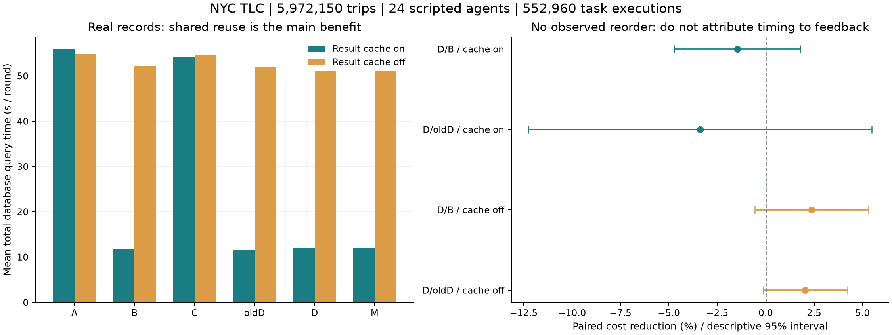

# 真实数据验证：反馈排序修正与 NYC TLC 实验

结论：本次确认了成本归集、训练/验证隔离和手动模式退化监测的修正；常规真实数据负载没有启用反馈换序，不能把组间耗时差解释为反馈获得加速。真实 LLM 未调用。

## 数据与处理

- 来源：[NYC TLC 官方行程数据](https://www.nyc.gov/site/tlc/about/tlc-trip-record-data.page)，2024 年 1、2 月 Yellow Taxi 与 Taxi Zone Lookup。官方提示数据由服务提供商提交，不保证全部记录准确。
- 原始行程 5,972,150 行；区域 265 行；从原始记录聚合得到区域日表 13,466 行。没有复制行程放大规模。
- PostgreSQL 表和索引 1,102,766,080 字节（1.027 GiB）；这不是原始 Parquet 大小。
- 保留负金额 71,584 行、乘客数为空 325,772 行、上车时间落在两个月之外 19 行；异常不做静默清洗。
- 选择原始列并重命名；金额转为两位小数 NUMERIC；添加仅用于稳定排序的行号。zone_day 是派生汇总，不是第三份独立真实数据集。

## 实验设计

- 24 个并发脚本 agent，连接池 16；真实模型费用/调用次数为零。A=独立经验库+固定顺序，B=共享+固定顺序，C=独立经验库+修正版反馈，D=共享+修正版反馈；另有 oldD（提交 6fb11ba 的共享反馈）和 M（共享+Mock）。
- 每种缓存条件 6 轮，每轮轮换 6 组的位置；每个组独立启动、清空 adapter 状态。所有组关闭 singleflight。两个缓存条件是先后运行，不把它们的差视为无偏缓存因果效应。
- 10 种结构 × 16 个繁忙区域/日期参数 × 2 个月 = 320 条 SQL；包括关联聚合、HAVING、CTE、窗口排名、条件聚合、去重和 Top-N。每个 agent 执行同一套任务，组内随机顺序的种子一致。
- 每组每轮 7,680 次任务，每个缓存条件 276,480 次；两个条件合计 552,960 次。参数文本数量不等于独立 SQL 结构数量。
- 先执行 1 月参数，再执行 2 月参数；数据在实验前已全部装载。这是时间参数迁移，**不是在线 ETL 或未知数据漂移实验**。
- 参考结果由只读 PostgreSQL 直连执行同一 SQL 得到，验证 adapter 的结果保持性；不是独立业务规格证明。参考执行和导入成本不计入测量组。
- 数据库成本是并发查询耗时之和，包含 adapter 初始化、检查、守护与业务执行，不等于墙钟时间。不清空 OS/PG 缓存，本机热缓存下结果不能外推生产吞吐。

## 全流程结果

|组|缓存开 DB 秒/轮|缓存关 DB 秒/轮|两条件正确/任务|两条件实际换序/排序次数|
|---|---:|---:|---:|---:|
|A|55.804|54.752|92,160/92,160|0/576|
|B|11.786|52.284|92,160/92,160|0/281|
|C|54.088|54.512|92,160/92,160|0/576|
|oldD|11.609|52.101|92,160/92,160|0/279|
|D|11.965|51.027|92,160/92,160|0/269|
|M|12.031|51.131|92,160/92,160|0/276|

降幅按同一轮配对后求均值，正数表示节约。括号为跨 6 轮的 Student-t 95% 描述性区间；不进行多重检验显著性宣称。

|比较|缓存开降幅 %（区间）|缓存关降幅 %（区间）|
|---|---:|---:|
|B/A|+78.82 [+76.94, +80.71]|+4.52 [+3.32, +5.71]|
|C/A|+3.00 [-1.48, +7.48]|+0.43 [-1.12, +1.98]|
|D/B|-1.47 [-4.73, +1.80]|+2.37 [-0.57, +5.31]|
|D/oldD|-3.39 [-12.25, +5.48]|+2.04 [-0.14, +4.23]|
|M/B|-2.65 [-18.54, +13.24]|+2.14 [-0.84, +5.13]|

上述正常关联全部通过，没有失败候选供门槛验证。D/oldD 的细小差异包含并发时序、冷启动重复检查及系统噪声，**不能归因于自适应排序**。M 也没有应用模型策略。

## 真实失败候选的专项测量

直接执行真实 PostgreSQL 检查 SQL：以每天的真实行程和区域表构造右键不唯一的候选。1 月 24 天 + 2 月 24 天，分别测试“仍需补查键以决定修复”和“修复已穷尽，无需补查”两个状态，独立重启重复 5 轮。未伪造检查耗时或失败率。

冻结评分器后用后续不同日期候选组验证；每个候选分别实际执行默认/候选顺序，交替先后顺序。每次另执行全部三项以收集观测，100% 补充观测的费用单列。这是单连接、无缓存的检查级专项，不是 24 agent 的完整 adapter 运行。第二个状态由实验显式指定，未证明生产负载会经常到达它。

|修复状态|候选数|已采纳/实际换序|判定一致|候选成本 ms|默认成本 ms|额外全量观测 ms|
|---|---:|---:|---:|---:|---:|---:|
|需补查键|240|0/0|240/240|5816.8|5769.3|12500.3|
|修复已穷尽|240|180/180|240/240|1968.4|5751.3|12491.4|

修复已穷尽条件下，跨 5 轮平均检查成本降幅 **65.78%**，描述性区间 [65.38%, 66.18%]。这是扣除额外证据收集成本之前的检查执行收益。

只比较候选与默认执行会忽略获取证据的代价。必须同时看额外观测成本、真实部署中失败比例与复用频率；本专项不支持“整个系统净加速”的结论。

## 修正与回归验证

- 历史执行成本不可变；后续命中不能再次折扣它，复用观测自身为零。已执行的键检查不重复收费。
- 评分器冻结；训练候选排除；重复候选组内平均；完整批次只决策一次。监测使用新的非重叠时间批次。
- 模型候选等待证据时不会被周期性重建；已完成且被拒绝的候选不能追加样本反复试到通过。
- HTTP 手动应用也有退化监测。集成测试用受控遥测验证自动回滚、且不生成新建议；受控测试数值不是上述真实数据性能证据。
- 31 项测试通过（包含两项 PostgreSQL 集成测试）；Clippy -D warnings、格式检查通过。已有复杂 SQL 语义边界问题未在本次修复范围内。

## 复现与文件

在项目目录安装实验依赖、启动已配置的 PostgreSQL 后：

```powershell
python -m pip install --target target/realdata-deps -r tools/requirements-real-data.txt
python tools/prepare-tlc.py
cargo build --locked --release
./tools/build-tlc-baseline.ps1
python tools/run-tlc-suite.py --agents 24 --variants 16 --rounds 6 --out results/tlc-final-cache-on
python tools/run-tlc-suite.py --agents 24 --variants 16 --rounds 6 --no-result-cache --out results/tlc-final-cache-off
$env:AGENTDB_URL = (Get-Content results/tlc-real-data/connection.txt -Raw).Trim()
./target/release/agentdb-mid.exe --out results/tlc-final-checks real-bench --oracle unused --check-study
2..5 | ForEach-Object { ./target/release/agentdb-mid.exe --out "results/tlc-final-checks-$_" real-bench --oracle unused --check-study }
python tools/report-tlc.py
```

- 导入会新建独立持久实验库，不修改 .env 指定的原数据库。连接信息保存在被 Git 忽略的 results/tlc-real-data/connection.txt。请勿上传该文件。
- 主结果：results/tlc-final-cache-on、results/tlc-final-cache-off；每个目录包含原始逐请求结果、检查轨迹、参考结果、源码与二进制 SHA-256、实际运行的 old/new 二进制。
- 专项：results/tlc-final-checks/check-study.json 及 tlc-final-checks-2 至 -5。整理后不含凭据的数值见 [JSON 汇总](real-data-validation.json)。
- 早期 results/tlc-validation-main、results/tlc-validation-hotspots 是调试阶段运行，未混入本报告。
- 原始文件 SHA-256 如下，便于发现官方文件后续替换：

- `yellow_tripdata_2024-01.parquet`：`c4d59da7bbc8abaeeeb1727947ee93d9891a71acb42854bd80db1571b2030510`
- `yellow_tripdata_2024-02.parquet`：`c76c43c18c6c6664080dd920baab4928988d5786a6b65980792ca7cd796f9f20`
- `taxi_zone_lookup.csv`：`1a99e105092230f8620f301edcca7f80d3080642ff404d28ed957d3fa222c8ed`

## 导出图


