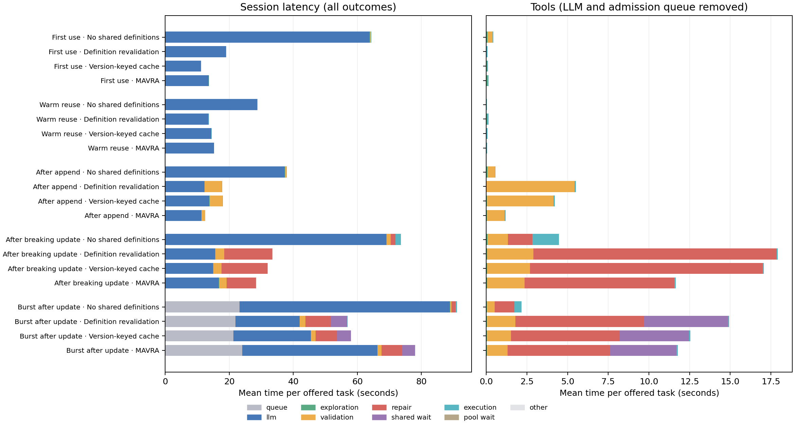

# 固定定义库的会话耗时实验结果

**完成 216 个会话：共享让任务更准确、更省模型成本；条件级维护降低了更新后的工具开销，但没有带来稳定的整体会话延迟优势。**

本实验受 [SMetric](https://arxiv.org/html/2607.08565v2) 的会话局部性与 SLO 约束启发，计量单位是一整次指标问答：包括全部模型往返、数据库工具和入场排队。SMetric 的研究对象是 LLM 集群的请求路由与 KV 缓存；这里评测数据库中间层中的定义共享和有效性维护。

设计见 [预定协议](README.md)。三份已学库，每份保留 M1/M2/M3 的全部有效变体（4 个定义），配对四种方法；100 万行，三道参数留出题，首次使用、热复用、正常追加后首用、状态流水破坏后首用，以及六请求/并发三的突发阶段。不共享组保留相同基础中间层和表/关联工具，但没有指标库；其余三组只改变维护配置。全部关闭答案缓存，使用 Agent 自己的学习 SQL 作为修复回归参照；每题一个全新 DeepSeek V4.1 Flash 会话，题面仅给指标名与查询参数。库导入在请求到达之前完成。

## 完整矩阵

每种方法 54 个会话，以下是本矩阵的描述性汇总；平均、分位数和成本包含全部尝试，正确任务吞吐仅计截止时间内答对的题。token 以接口上报用量计，每个正确答案的成本将失败尝试的消耗计入分子。吞吐分母为各阶段实际服务窗口之和，突发阶段按整批窗口计量。

| 方法 | 正确 / 54 | 平均完成 s | 中位数 s | P95 s | LLM 往返/题 | 输入 token/正确答案 | DB 总 s | 正确任务/min @60s |
|---|---:|---:|---:|---:|---:|---:|---:|---:|
| 不共享定义 | 16/54 | 64.47 | 39.19 | 200.01 | 5.43 | 55110 | 88.89 | 0.291 |
| 定义级重验 | 54/54 | 32.97 | 22.26 | 77.17 | 3.76 | 9227 | 388.43 | 2.770 |
| 通用版本缓存 | 54/54 | 31.97 | 21.19 | 81.02 | 3.74 | 9137 | 342.35 | 2.877 |
| MAVRA | 54/54 | 37.68 | 18.96 | 90.52 | 3.83 | 9689 | 255.79 | 2.365 |

DB 总时间只统计计分窗口内实际执行的 SQL，含探索、验证、修复和业务查询；不含库导入、更新与判题。它是数据库工作量，不能直接当成每个会话的关键路径耗时。完整分阶段结果见 [汇总](summary.md)、[token 成本](cost.md)、[三个预定时限](slo.md)；逐库结果见 [配对表](per-library.md) 和 [stats.json](stats.json)。

## 维护节省何时进入任务时间



图左包括入场排队与 LLM；右移除这两项，显示工具关键路径。验证、修复、合并等待等按互斥时间区间分解，嵌套 span 不重复相加。可导出 [PDF](latency-decomposition.pdf) / [SVG](latency-decomposition.svg)，数值见 [分解表](decomposition.md)。

| 阶段 | 不共享定义 s | 定义级 s | 通用缓存 s | MAVRA s |
|---|---:|---:|---:|---:|
| 库导入后首次使用 | 64.33 | 19.06 | 11.24 | 13.70 |
| 热复用 | 28.81 | 13.63 | 14.47 | 15.28 |
| 正常追加后首用 | 37.93 | 17.82 | 18.00 | 12.53 |
| 破坏性更新后首用 | 73.58 | 33.50 | 32.01 | 28.41 |
| 破坏性更新后突发 | 91.09 | 56.92 | 58.05 | 78.07 |

首次使用与热复用中，LLM 接口占共享组服务时间的 98.9–99.6%，维护基本不在关键路径。正常追加后，MAVRA 的验证时间为每题 1.08 s，通用缓存 4.10 s、定义级 5.43 s；完整任务从通用缓存的 18.00 s 降到 12.53 s（本轮低 30.4%）。状态流水更新后，验证 + 修复为 11.50 s，通用缓存 16.95 s、定义级 17.78 s（合计由未舍入分项计算）；完整任务为 28.41 / 32.01 / 33.50 s。更新后的维护开销确实有机会影响会话时间。

但突发阶段 MAVRA 为 78.07 s，通用缓存 58.05 s、定义级 56.92 s。第三份库的一次 MAVRA 请求耗时 356.23 s，其中 LLM 接口 338.45 s、其余服务时间 17.78 s，已全部保留。该接口时间包含网络、后端等待及已有客户端的重试，不能解释为纯模型计算。MAVRA 的突发工具时间仍较少（约 11.78 s/题，通用缓存 12.55 s、定义级 14.93 s），但这不足以抵消本轮模型长尾。

全矩阵 MAVRA 的 DB 查询时间比定义级低 34.1%、比通用缓存低 25.3%，三个库均如此；整体平均完成时间却分别高 14.3%、17.9%。相对通用缓存，MAVRA 只在第一份库的整体平均时间上更快，另两份更慢。60 秒内正确任务吞吐为 2.365/min，低于通用缓存的 2.877/min 与定义级的 2.770/min。预定 30/60/120 秒时限内答对的任务数分别是 MAVRA 33/44/52，通用缓存 32/46/54，定义级 30/46/54。中位数较低和少做数据库工作，均不足以支撑“所有到达方式下整体更快”的结论。

## 对我们的启示

相对不共享定义，MAVRA 正确率从 29.6% 到 100%，本轮平均完成时间从 64.47 s 到 37.68 s，每题模型往返从 5.43 到 3.83。输入 token/尝试从 16,329 到 9,689（低 40.7%）；输入 token/正确答案从 55,110 到 9,689（低 82.4%，同时反映正确率改善）。输出 token/尝试为 2,643 对 635。共享的价值包括减少每个新会话重新推导业务含义，以及在更新之后持续提供可用定义。

评价指标应同时覆盖正确性、完整会话成本和截止时间内的正确任务吞吐。正文的效率结论可以限定为：更新后验证和修复的数据库开销更小；本轮更新后串行首用更快；相对通用缓存的整体延迟与突发服务优势尚未建立。有效性保证与有界修复仍是系统主线，单独的缓存命中或维护毫秒数不应代替任务收益。

## 启动成本、边界与复算

四个定义的平均导入/准入耗时：MAVRA 9.24 s、通用缓存 17.82 s、定义级 19.61 s；不共享的中间层启动约 0.024 s。它们单列在 [启动表](startup.md)，不进入逐任务完成时间；原学习成本没有重测。首次使用也不表示 OS 或数据库冷缓存。

只有三个独立库、一个模型、三道指标题和一个六请求突发，没有到达率扫描或数据库饱和压力测试。每个方法每个串行阶段仅 9 个样本、突发 18 个；P95 用经验最近秩分位数，不能据此宣称统计显著。方法顺序按库轮换，最多两库并行，但模型后端负载和作答随机性未受控。写入在请求到达前完成，因此不评测并发写入与快照绑定。数据库沿用实验服务器关闭 WAL/fsync 的配置。当前结果不外推到其他模型、真实业务库或 LLM 集群路由。

主实验于 2026-10-03 07:42:01–08:45:04 UTC 在 noctis 完成，三个进程退出码均为 0，216 个请求中 178 个正确、33 个错误、5 个澄清，无接口/执行错误；三个实验数据库均清理。905 次实际模型回复全部报告为 `deepseek/deepseek-v4.1-flash`，与既有模型配置一致。输入快照 SHA-256、方法间定义一致性、token 计量和清理核验见 [audit.json](verification/audit.json)。运行命令和起止时间保存在 [launcher.json](raw/launcher.json)、[launcher-results.json](raw/launcher-results.json)。

原始数据在 `raw/`，逐请求与工具轨迹采用无损 gzip；传输时完整归档在 `verification/main-raw.tar.gz`。本次编译实际使用的 Rust 源码、Cargo 清单与数据文件在 `verification/run-source.tar.gz`，二进制 SHA-256 为 `a034a62e16a03ca7165533ba779581b64564984aa73d691b7d620bdebb2d9073`。

```bash
# 从存档复算；不需要模型 API 或数据库
python3 tools/session-latency-stats.py \
  exp/2026-10-03-session-latency/raw/dsv*/session-*/ \
  --out exp/2026-10-03-session-latency --plot --tex-out overleaf/gen

# 在实验服务器重新编译并运行；使用已有 .env 模型配置，选择新输出目录
/root/.cargo/bin/cargo build --release --locked
python3 tools/run-session-latency.py \
  --sources-root exp/2026-10-03-session-latency/raw/inputs \
  --out results/session-latency-reproduce --jobs 2
```

检查已通过：38 个单元测试、另行启用的 PostgreSQL/HTTP 生命周期集成测试、格式检查、Clippy 全目标检查和 release 编译；4 个默认忽略的数据库测试按原规则保留。分析同时验证全部阶段的 SQL 数量/耗时归属、固定库配对、互斥分解之和与完成时间恒等式，所有请求均纳入。
